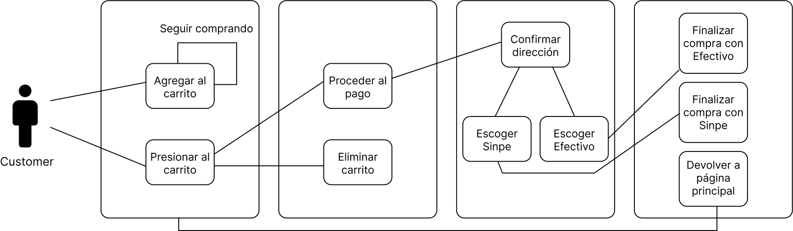
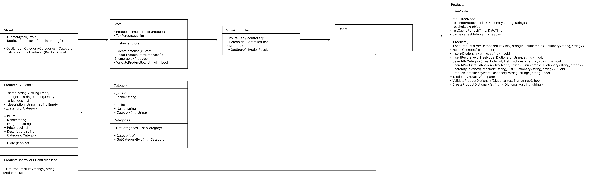
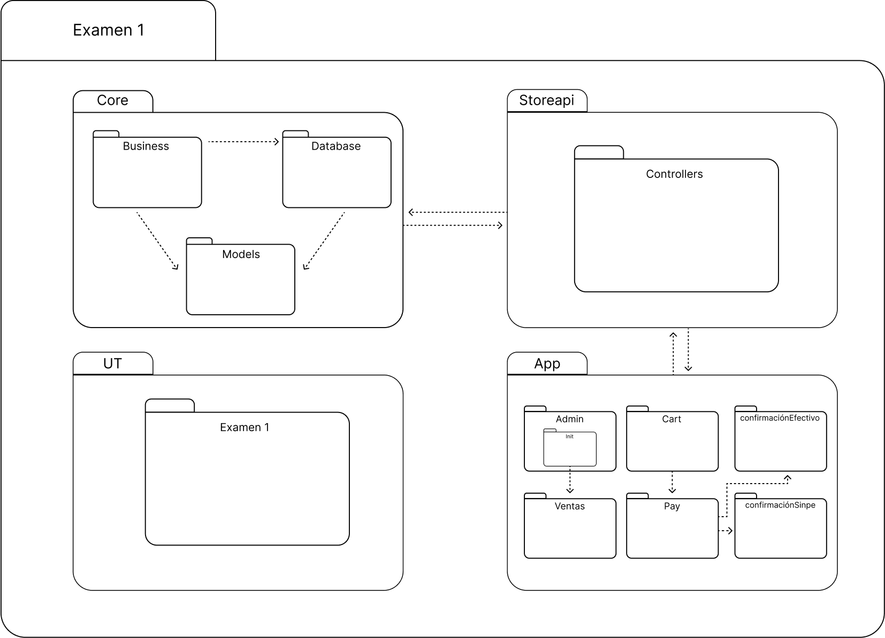

# Examen

En este repositorio encontrarás varios diagramas relacionados con el proyecto.

## Diagrama de Actividad

Este diagrama muestra las actividades y flujos de trabajo dentro del sistema.

## Diagrama de Clase

El diagrama de clase representa la estructura estática del sistema, mostrando las clases y sus relaciones.

## Diagrama de Paquetes

El diagrama de paquetes muestra la organización modular del sistema, agrupando clases relacionadas en paquetes.
