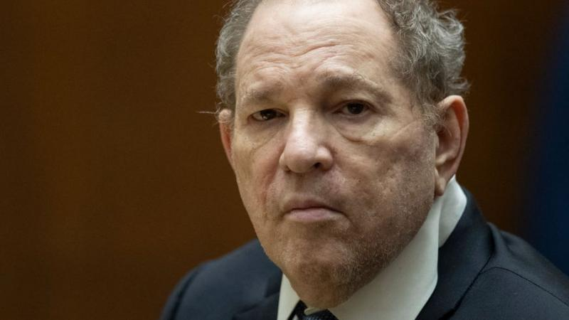
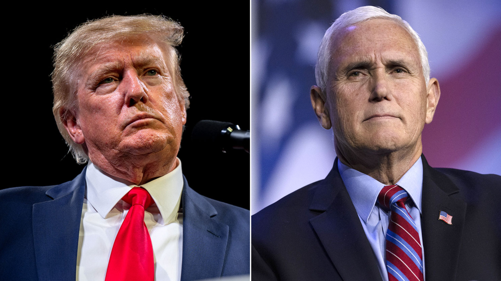

<h1>Opinión acerca de movimiento #MeToo y el efecto Pence</h1>

<h2>Contexto sobre #MeToo </h2>

 El movimiento #MeToo fue iniciado en el año 2006 a través de la red social MySpace de la mano de la activista feminista Tarana Burke, no obstante, fue hasta el añon 2017 que por la plataforma Twitter la actriz Alyssa Milano utilizó ese hashtag para invitar a otras mujeres, ya sea de forma anónima o no, a compartir sus historias de acoso sexual y violencia de género. Esta acción provocó que otras actrices famosas reconocidas en Hollywood como Ashley Judd, Mira Sorvino, Angelina Jolie y Gwyneth Paltrow compartieran sus testimonios y denuncias sobre conductas sexuales inapropiadas cometidas por varios actores, directores y productores reconocidos en el medio, siendo el más destacado el productor Harvey Weinstein el cual actualmente esta cumpliendo una sentencia de 23 años de prisión (con posibilidades de ser alargada debido a distintos cargos hechos por mujeres relacionadas a él) por agresión sexual. 

<a href="https://www.bbc.com/mundo/noticias-64752543#:~:text=Pie%20de%20foto%2C,sexual%20que%20datan%20de%202013.">Para leer más sobre la condena de Harvey Weinstein. "Extraido de BBC Mundo" </a>

Dicho lo anterior Weinstein no fue el único desenmascarado por el movimiento MeToo si no que junto a él fueron denunciados varios otros hombre importantes en la industria, nombres como lo son: 

<li>Kevin Spacey</li> 
<li>Woody Allen</li>
<li>Bill Cosby</li>
<li> Louis C.K. </li>
<li> Roman Polanski </li>
<li> Brian Singer</li>
<li> James Franco</li>

 Por lo anterior mostrado se podria decir que el #MeToo tiene la misión de darle voz a las víctimas de crimenes de índole sexual y empoderarlas a denunciar este tipo de actos deleznables.

<h2>Contexto sobre el efecto Pence</h2>

Toda acción tiene una reacción y el #MeToo no es la exepción, la prueba de ello es el denominado "Efecto Pence" el cual es una línea de pensamiento impulsada por el ex-vicepresidente de los EE.UU durante el mandato de Donald Trump, Mike Pence, la cuál dicta que los hombres en un ambiente laboral deben ser precavidos con las mujeres mediante acciones como no estar a solas con ellas o no sentarse a comer con mujeres sin que este una tercar persona ahí. Esto con el fin de evitar malentendidos o posibles denuncias falsas de acoso que puedan significar un daño a la reputación del hombre involucrado, así aumentando el nivel de desconfianza que se le puede tener al sexo contrario.
 

En varios lugares de trabajo como la meca financiera Wall Street se ha empezado a impulsar el Efecto Pence, lo cual ha cambiado en cierta medida la interacción entre entre hombres y mujeres ya que estos se muestran muy precavidos a la hora de interactuar con ellas, sin embargo, esto también a causado rechazo por parte de otras mujeres que opinan que esto es una manifestación de discriminación por género que podría acarrear que ellas pierdan oportunidades laborales y que su desarrollo profesional se vea truncado.

<a href=" https://www.elmundo.es/yodona/lifestyle/2019/05/19/5cd92bbefc6c832a5b8b4613.html">Para leer más acerca del "Efecto Pence". "Extraido de El Mundo" </a>

<h2>Mi opinión</h2>

Ciertamente opino que el efecto Pence es un poco extremo a por lo que propone a la hora de tratar con mujeres, ya que ellas son tan importantes como los hombres en cualquier área, sin embargo, pienso que también un hombre debe cuidarse y no exponerse a cualquier persona, ya que no se sabe que intenciones tenga esta. Además, el #MeToo es un movimiento al cual se han integrado cantidades masivas de personas en los últimos años, por lo que se han podido unir personar con buenas intenciones como personas que buscan hacerle daño a otras, ya sea porque buscan un beneficio económico o algo por el estilo. 

Aparte, considero que no solamente el movimiento #MeToo sino las que otros movimientos nacidos en las redes sociales, han perjudicado a un elemento crucial en los procesos jurídicos, el cual es la presunción de inocencia o el "soy inocente hasta que se demuestre lo contrario", puesto que se ha vuelto tendencia señalar a alguien muy fácil (sobretodo con acusaciones de índole sexual) de algún crimen en redes sociales. Para concluir, me gustaría decir que el movimiento #MeToo trajó algo positivo como la revelación de personas que hicieron cosas horribles, pero también dejar en claro, que deja la puerta libre para que personas inocentes sean acusadas injustamente, por lo que de cierta forma aunque me parezca un poco exagerado comprendo el porque ciertos ambientes laborales respaldan el efecto Pence.

<h2>Referencias</h2>

<a>BBC. (2023, febrero 23). Harvey Weinstein: condenan a otros 16 años de cárcel por delitos sexuales al exproductor de Hollywood pese a que pidió clemencia. _BBC_. https://www.bbc.com/mundo/noticias-64752543#:~:text=Pie%20de%20foto%2C,sexual%20que%20datan%20de%202013.</a>

<a>El País. (2019, febrero 28). Los señalados por las víctimas del MeToo. _El País_. https://elpais.com/elpais/2019/02/27/album/1551292811_446678.html</a>

<a> Scarpellini, P. (2019, mayo 19). Efecto Pence o cómo han cambiado las relaciones laborales en EEUU tras el #MeToo. _El Mundo_. https://www.elmundo.es/yodona/lifestyle/2019/05/19/5cd92bbefc6c832a5b8b4613.html</a>

<a>Sahuquillo, M.R., & Mars, A. (2017, diciembre 24). MeToo: ‘Yo también’ y la revolución de las mujeres. _El País_. https://elpais.com/internacional/2017/12/23/actualidad/1514057371_076739.html</a> 

