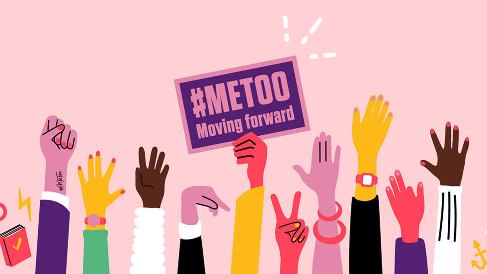

<h1 style="center">El movimiento #MeToo y su relación con el efecto Efecto Pence'</h1>

#ME__TOO es un movimiento cuyo propósito es visibilizar y apoyar a a todas las personas que han sufrido o sufren de acoso en la industria cinematográfica de Hollywood. Alcanzó tanta popularidad que hoy en dia abarcar otras industrias laborales e incluso organizaciones públicas y privadas. 

Según la revista "" el "ME TOO" es el lema utilizado para dar voz a todas las víctimas de acoso y abuso sexual por parte de personas mas poderosas, en términos de dinero y jerarquía. Ahora, no es para nada curioso si nos ponemos a pensar que casi todos los acusados son hombres, y podemos confirmar esto con la lista de recopilación hecha por CNN acerca de los acusados 👮: 

<li>James Toback</li>
<li>Ben Affleck</li>
<li>Kevin Spacey</li>
<li>George H.W. Bush</li>
<li>Chris Savino</li>
<li>Roy Price</li>
<li>Lockhart Steele</li>
<li>John Besh</li>

>*Cabe destacar que son solo unos pocos de los 200 acusados en total y en crecimiento hasta la actualidad.

#<h3>"Pero, ¿qué tiene que ver este movimiento con el efecto "Pence"?"</h3>
***

Bueno, originalmente el efecto "Pence" hacía referencia a las decisiones drásticas de personas poderosas y adineradas de crear cuentas de ahorro especiales para evitar perder su riqueza ante posibles catástrofes económicas, políticas y sociales. Ahora, en el 2018, casi un año después de la creación del movimiento "ME TOO" y que este tomara gran fuerza, muchos hombres poderosos, entre ellos el vicepresidente de EEUU, Mike Pence, comenzaron a tergiversar y malinterpretar el objetivo de este movimiento durante diferentes conferencias o entrevistas, e incluso algunas acciones como evitar contacto directo con mujeres.

Esta distorsión del movimiento se podría deber a ciertos comportamientos machistas entre los hombres que los hace creer que estos "ataques" son dirigidos hacia ellos por el hecho de ser hombres, cuando en realidad se busca denunciar a aquellos hombres que son partícipes de actos de acoso y abuso. También podríamos verlo como una forma de querer evitar ser falsamente acusados. Por lo que, a modo de resumen, el efecto Pence es cuando los hombres evitan, aíslan o ignoran a las mujeres en diferentes ámbitos para evitar (según ellos) problemas, altercados o acusaciones de cualquier índole.

><a href="https://latinamericanpost.com/es/americas-es/de-que-se-trata-el-efecto-pence/">Para leer más sobre el efecto Pence y su origen: 🧑‍💼</a>

#<h3>Opinión:</h3>
***

Es desafortunado cómo la falta de información, burlas, actitudes machistas, desconcientización social y la desinformación misma ocasionada por medios amarillistas; ocasionan que movimientos sociales y otras luchas similares pierdan apoyo y visibilización; apoyo necesario debido a que al ser víctimas de personajes con mucho poder, estos pueden manipular todo a su antojo para salir impunes.

Muchos ejemplos de este efecto Pence pueden observarse en redes sociales, donde publicaciones relacionadas a movimientos sociales feministas están repletas de comentarios y reacciones negativas y despectivas hacia su causa.

Todo esto conlleva a un ciclo sin terminar de violencia y acoso hacia las mujeres e incluso hombres. Imaginemos... si a una mujer le es difícil denunciar y hacerse visible ante la sociedad para demandar a un victimario, es aún más difícil para los hombres que sufran casos similares, los cuales por lo general son objetivos de burlas y mofas.

Por eso, todo movimiento social que apoye el bienestar tanto mental, físico y social merece todo el apoyo que sea posible, porque al final de cuentas, como sociedad estamos prácticamente relacionados.

#<h3>Referencias bibliográficas</h3>
***

<a>CNN. (26 de octubre de 2017). La lista incompleta de poderosos acusados de acoso sexual, tras escándalo de Harvey Weinstein. Obtenido de CNN: https://cnnespanol.cnn.com/2017/10/26/la-lista-incompleta-de-poderosos-acusados-de-acoso-sexual-tras-escandalo-de-harvey-weinstein/
</a>

<a>Latinoamerican Post. (20 de diciembre de 2018). ¿De qué se trata el efecto Pence? Obtenido de Latinoamerican Post: https://latinamericanpost.com/es/americas-es/de-que-se-trata-el-efecto-pence/</a>

<a>Revista UCR. (10 de noviembre de 2021). ME TOO: ¿UN MOVIMIENTO O UN MOMENTO? Obtenido de Revista UCR: file:///C:/Users/Hewlett%20Packard/Downloads/51858-Texto%20del%20art%C3%ADculo-218204-1-10-20220718.pdf</a>