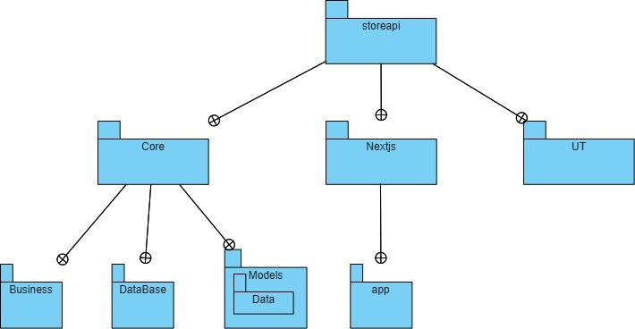
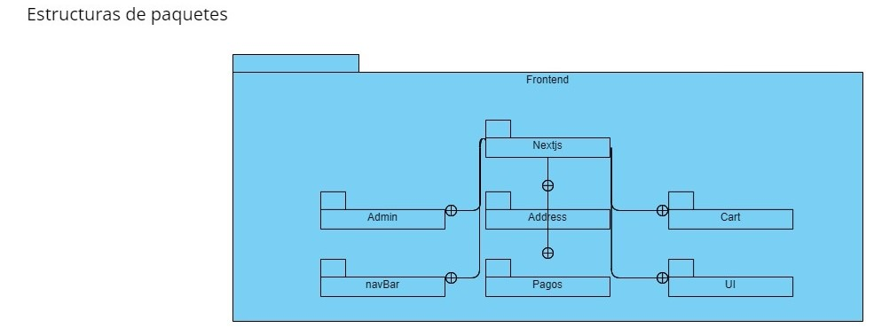
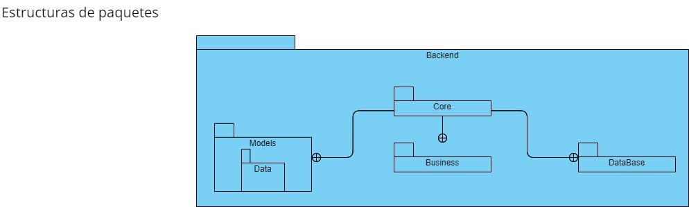
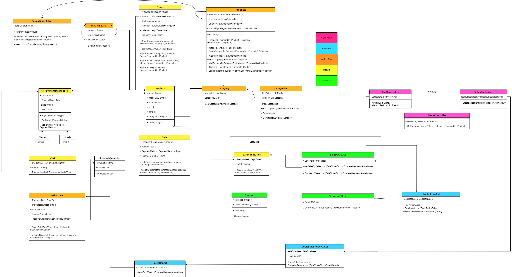

# Tienda en Línea

Este proyecto es una tienda en línea desarrollada con React y Next.js. Permite a los usuarios explorar productos, agregarlos a un carrito de compras, realizar búsquedas por categorías y texto, y completar el proceso de compra.

## Características

- Catálogo de productos por categorías
- Carrito de compras
- Búsqueda por categorías y texto
- Proceso de compra (dirección de entrega y método de pago)
- Administración de inventario (en desarollo y solo para administradores)

## Estructura de Paquetes

- `app/`: Contiene las pantallas reutilizables de React para la interfaz de usuario.
- `pages/`: Contiene las páginas de la aplicación Next.js
- `controllers/`: Contiene utilidades y funciones auxiliares, como la interacción  y llegada a la API.

### Diagramas de Clases

## Diagrama de paqueteria del proyecto

## Diagrama de Paquetes del Frontend 

## Diagrama de Paquetes del Backend 

## Diagrama de clases del Backend

